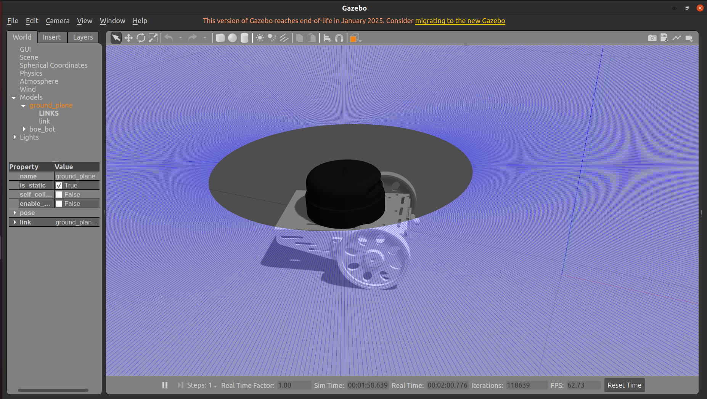
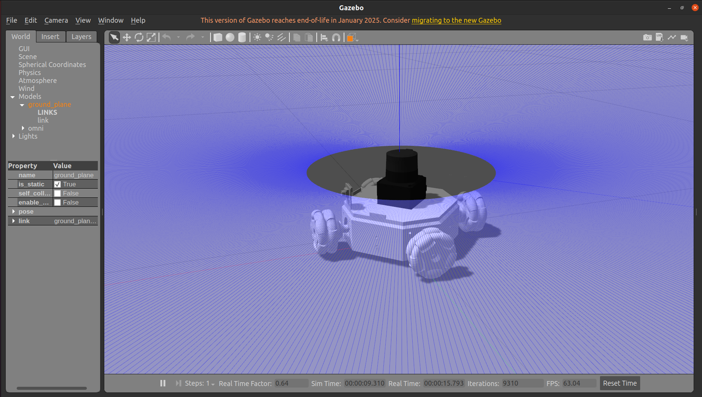
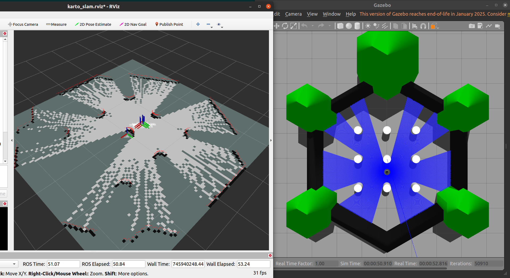
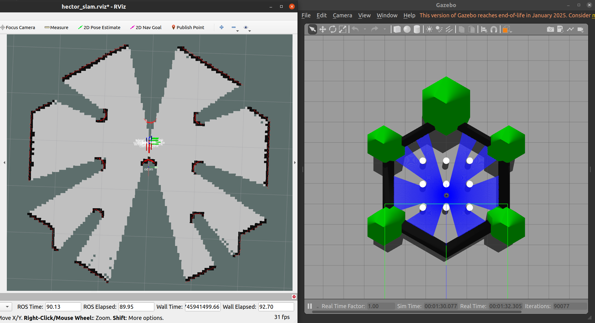
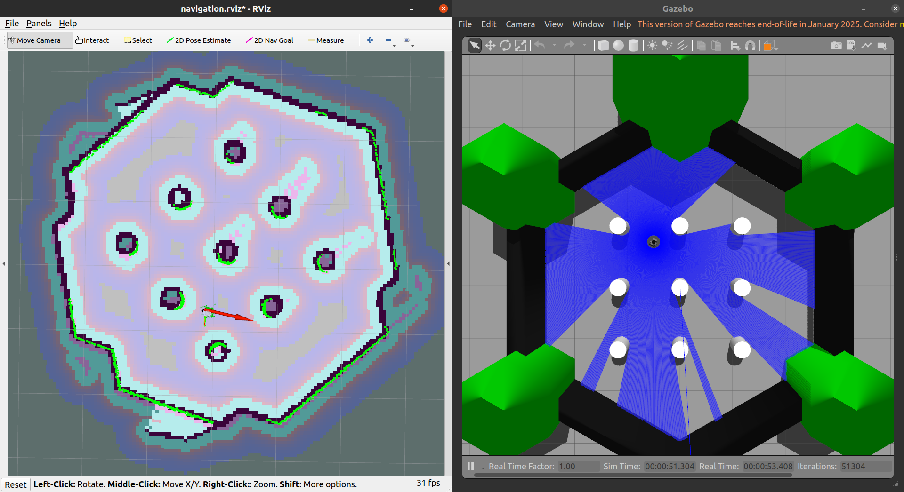
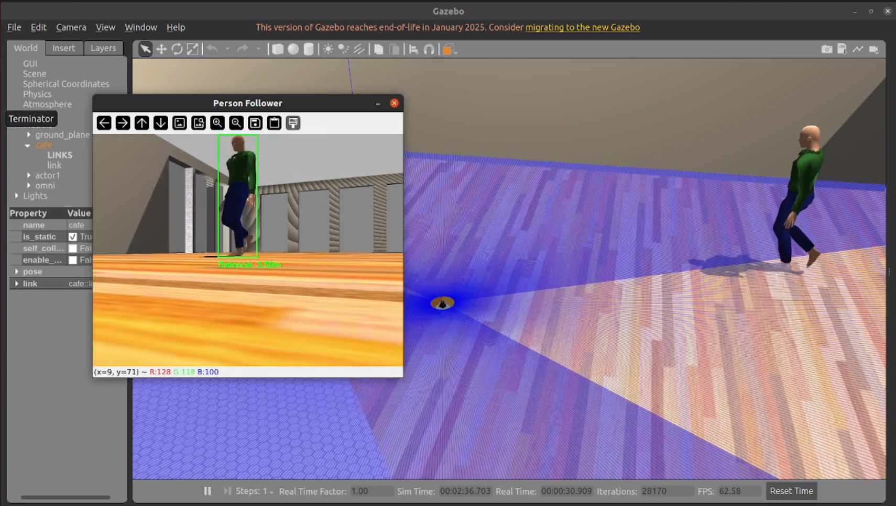

# Hướng dẫn 


---
---
## Kết quả
https://www.youtube.com/watch?v=XNcM_ScEpm4
## Lưu ý

- Đảm bảo đường dẫn các file map.yaml trong Omni_Diff_Robot/omni_diff/maps được sửa thành đường dẫn đúng của máy nếu muốn chạy navigation trực tiếp

---
## Yêu cầu

**Laptop:**
- Ubuntu 20.04 với ROS Noetic (Cài đặt ROS Noetic).

**Workspace:**  
- Không gian làm việc ROS (ví dụ: `~/catkin_ws`).

---

## Cài đặt

### Clone Repository

```bash
cd ~/catkin_ws/src
git clone https://github.com/EBang2k4/Omni_Diff_Robot.git
cd ~/catkin_ws
catkin_make
source devel/setup.bash
```
### Tải Thư viện cần thiết

```bash
sudo apt update
sudo apt install ros-noetic-vision-msgs
pip3 install ultralytics
sudo apt install ros-noetic-hector-slam
sudo apt install ros-noetic-slam-karto
```
## Mô hình 3D
### Boe_bot
   

### Omni bot
   
## Chạy SLAM

- CHỌN MODEL CHO ROBOT `omni` HOẶC `boe_bot`
- Model `boe_bot` 2 bánh:

```bash
export OMNI_DIFF_MODEL=boe_bot
```
- Hoặc model `omni` 4 bánh:

```bash
export OMNI_DIFF_MODEL=omni
```

### Chạy KARTO SLAM:

```bash
roslaunch omni_diff_slam omni_diff_karto_slam.launch 
```
   
### Chạy HECTOR SLAM:

```bash
roslaunch omni_diff_slam omni_diff_hector_slam.launch 
```
   

### Mở Terminal mới, chạy Teleop_Node để quét map:

```bash
rosrun omni_diff_teleop omni_diff_teleop_key 
```

- Lưu map sau khi quét bản đồ:

```bash
rosrun map_server map_saver -f ~/catkin_ws/src/Omni_Diff_Robot/omni_diff/maps/TÊN_MAP
```

## Chạy NAVIGATION

- CHỌN MODEL CHO ROBOT `omni` HOẶC `boe_bot`
- Model `boe_bot` 2 bánh:

```bash
export OMNI_DIFF_MODEL=boe_bot
```
- Hoặc model `omni` 4 bánh:

```bash
export OMNI_DIFF_MODEL=omni
```

### Chạy NAVIGATION:

```bash
roslaunch omni_diff_navigation navigation.launch 
```
   
## Chạy HUMAN TRACKING:

- CHỌN MODEL CHO ROBOT `omni` HOẶC `boe_bot`
- Model `boe_bot` 2 bánh:

```bash
export OMNI_DIFF_MODEL=boe_bot
```
- Hoặc model `omni` 4 bánh:

```bash
export OMNI_DIFF_MODEL=omni
```
### Chạy Human tracking Node:

```bash
roslaunch omni_diff_human_tracking yolo_tracker.launch 
```
   
